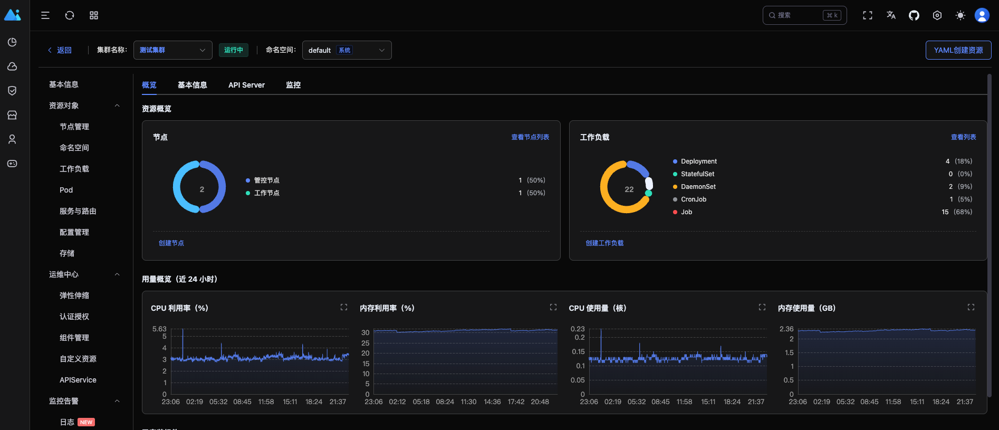
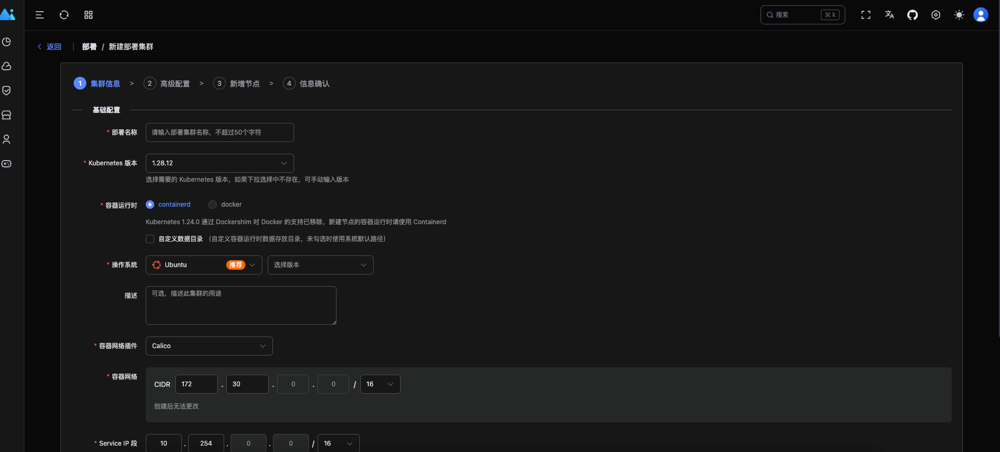
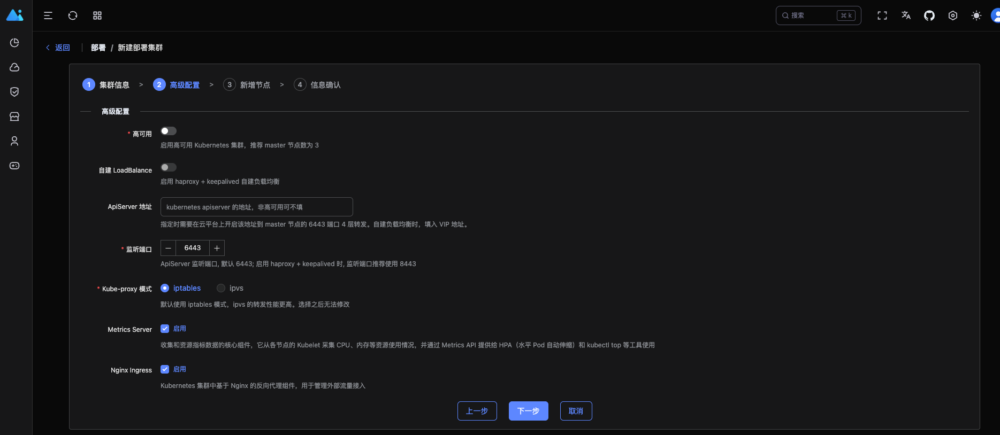
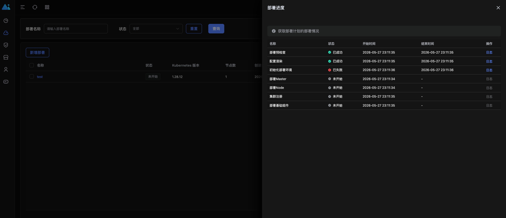
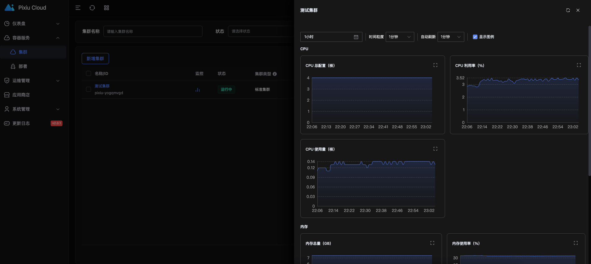
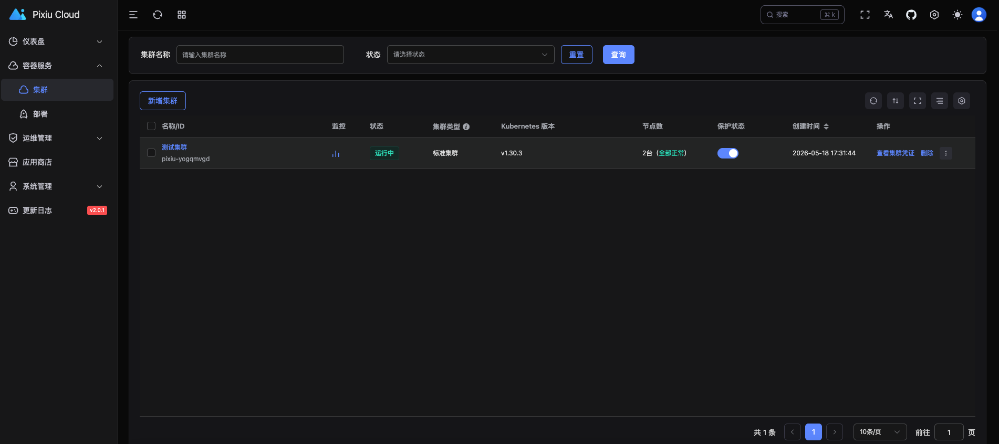
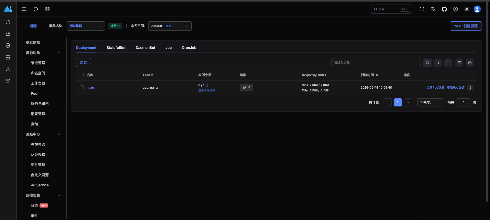
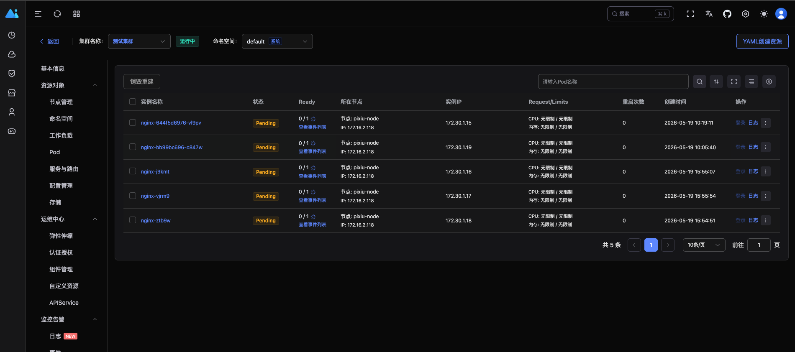
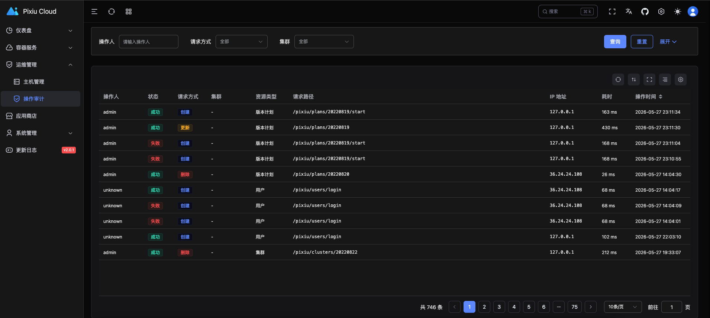

# Pixiu Overview

Pixiu is an open source container platform for cloud-native application management.

![Build Status][build-url]
[![Release][release-image]][release-url]
[![License][license-image]][license-url]

## 安装手册
- [安装手册](install.md)

## 页面展示
### 首页


### 部署集群
- 创建部署
    ```text
    通过新建部署计划,可以实现通过页面 `点点点` 的方式创建 `kubernetes` 集群, 如同各大云厂商一样
    ```
    

- 新建节点
    ```text
    1. 添加各个节点的信息，节点的角色，用户名，密码等
    2. 各大组件支持高度的自定义，例如：calico，fannel
    2. kubernetes 版本自主选择
    ```
    

- 部署详情
    ```text
    可以看到部署计划在每个部署的运行状态，以及详细日志
    ```
    

### 集群管理
- 集群概览
    ```text
    cpu状态，内存状态，集群的基本信息，网络信息，集群服务
    ```
    

- 集群管理


- 集群工作负载deployment


- 集群工作负载pod


### 审计功能
- 审计管理


## 学习分享
- [go-learning](https://github.com/caoyingjunz/go-learning)

## 沟通交流
- 搜索微信号 `yingjuncz`, 备注（pixiu）, 验证通过会加入群聊
- [bilibili](https://space.bilibili.com/3493104248162809?spm_id_from=333.1007.0.0) 技术分享

Copyright 2019 caoyingjun (cao.yingjunz@gmail.com) Apache License 2.0

[build-url]: https://github.com/caoyingjunz/pixiu/actions/workflows/ci.yml/badge.svg
[release-image]: https://img.shields.io/badge/release-download-orange.svg
[release-url]: https://www.apache.org/licenses/LICENSE-2.0.html
[license-image]: https://img.shields.io/badge/license-Apache%202-4EB1BA.svg
[license-url]: https://www.apache.org/licenses/LICENSE-2.0.html
