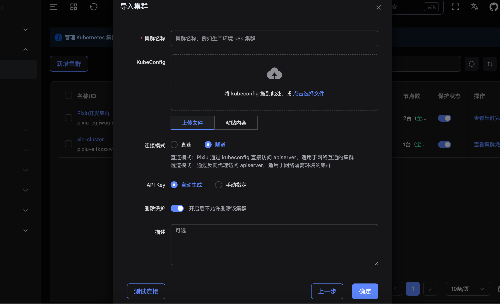

# Pixiu Cluster Agent（反向隧道代理）

集群内部署的轻量 Sidecar，出站连接 Pixiu 控制面，使控制面能够访问网络隔离环境下的集群 kube-apiserver。

## 工作原理

```
┌──────────────┐                      ┌─────────────────┐
│  Pixiu 控制面 │  ◄────────────────── │  Cluster Agent  │
│              │   出站（Agent 发起）   │  （集群内部署）   │
└──────────────┘                      └────────┬────────┘
        │                                      │
        │                                      │ 直连
        ▼                                      ▼
  ┌──────────┐                         ┌──────────────┐
  │ 其他服务   │                        │ kube-apiserver │
  └──────────┘                         └──────────────┘
```

- Cluster Agent 以 Deployment 形式部署在目标集群内，使用 `cluster-admin` 权限
- Agent 主动向 Pixiu 发起连接（出站，无需开入站端口）
- Pixiu 通过隧道拨号访问集群内 apiserver，适用于 NAT/防火墙后的网络不通的 Kubernetes 集群

## 前置条件

- 集群中已安装 `kubectl` 并具备管理员权限
- Pixiu 控制面已部署，且 Agent 可访问控制面的公网/内网地址
- 在 Pixiu 中已创建 Agent Token（导入集群时选择「隧道」模式自动生成，或手动创建）

## 安装步骤

### 1. 生成 Agent Token

在 Pixiu 控制面导入集群时选择「隧道」连接模式，系统自动生成 Token。


### 2. 部署 Cluster Agent

```bash
# 编辑环境变量
vim cluster-agent.yaml

# 修改 PIXIU_SERVER 和 PIXIU_TOKEN，并执行安装
kubectl apply -f cluster-agent.yaml
```

### 3. 验证状态

```bash
kubectl -n pixiu-system get pods -l app=pixiu-cluster-agent
kubectl -n pixiu-system logs -l app=pixiu-cluster-agent
```

正常日志应显示 `tunnel connected, waiting for dial requests`。

### 4. 平台验证

```bash
Pixiu 管理页面查看是否可以看到 Kubernetes 信息
```
