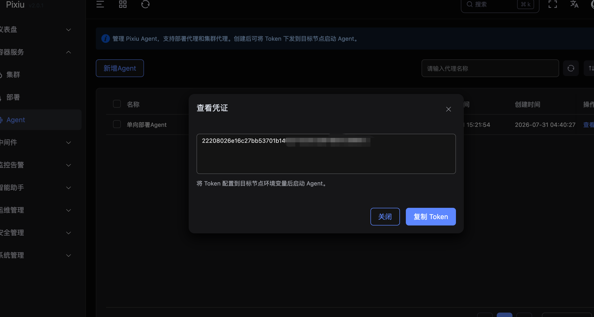

# Pixiu Deploy Agent

边缘节点主动出站连接 Pixiu，拉取部署任务与计划数据，在本地渲染配置并通过安装驱动容器完成集群部署。

## 工作原理

```
┌──────────────┐  HTTPS (出站)  ┌──────────────┐
│  Pixiu 控制面  │ ◄──────────── │  Deploy Agent │
│              │  拉取任务/回传   │  （边缘节点）   │
└──────────────┘                └──────┬───────┘
                                       │ socket
                                       ▼
                               ┌──────────────┐
                               │ 部署容器运行时  │
                               └──────────────┘
```

- 有任务时拉取执行，完成后回传结果
- 适用于单向网络环境（Agent 可访问控制面，反之不可）

## 前置条件

- Pixiu 控制面已部署，Agent 可访问控制面地址
- 已在控制面创建 Agent 并获取 Token
- Agent节点已安装 docker

## 安装步骤
### 0. docker 极速安装
[Docker极速安装](../offline/docker.md)

### 1. 获取 Token

在 Pixiu 管理页面「代理管理」中新增一个 **部署代理**，复制生成的 Token。


### 2. 下载二进制文件

```bash
# 下载最新版本
curl -Lo /usr/local/bin/pixiu-deploy-agent \
  https://pixiu-1302939330.cos.ap-guangzhou.myqcloud.com/deploy-agent/pixiu-deploy-agent
chmod +x /usr/local/bin/pixiu-deploy-agent
```

### 3. 生成配置文件

```bash
mkdir -p /etc/pixiu

cat > /etc/pixiu/agent.yaml <<EOF
default:
  server: "https://pixiu.example.com"
  token: "<your-agent-token>"
EOF

# 配置文件优先于环境变量，留空时回退到环境变量
```

### 4. 注册 systemd 服务

```bash
cat > /etc/systemd/system/pixiu-deploy-agent.service <<EOF
[Unit]
Description=Pixiu Deploy Agent
After=network.target docker.service
Wants=docker.service

[Service]
Type=simple
ExecStart=/usr/local/bin/pixiu-deploy-agent -config=/etc/pixiu/agent.yaml
Restart=always
RestartSec=5
LimitNOFILE=65536

[Install]
WantedBy=multi-user.target
EOF

systemctl daemon-reload
systemctl enable pixiu-deploy-agent
systemctl start pixiu-deploy-agent
```

### 5. 验证状态

```bash
systemctl status pixiu-deploy-agent
journalctl -u pixiu-deploy-agent -f
```

正常日志应显示 `pixiu-deploy-agent v0.1.0 starting, server=https://pixiu.example.com`，且心跳日志定期出现。
