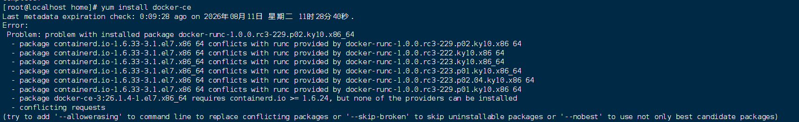
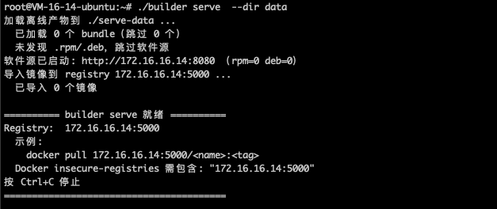

> 部署计划「自定义源」填写示例见 [自定义安装包仓库配置](../../docs/deploy/custom-repo.md)。

### 将 3 个离线包移到 data目录里，进行自动加载
```bash
root@localhost:~# mv pixiu-images-amd64-v1.31.6.tar.gz  pixiu-packages-kylin-v10-amd64-v1.31.6.tar.gz pixiu-server-images-amd64.tar.gz data/
```
正常回显
```bash
检测到新离线包 data/pixiu-images-amd64-v1.31.6.tar.gz，正在加载 ...
  + 10.206.32.17:5000/calico-cni:v3.31.3
  + 10.206.32.17:5000/calico-kube-controllers:v3.31.3
  + 10.206.32.17:5000/calico-node:v3.31.3
  + 10.206.32.17:5000/calico-typha:v3.31.3
  + 10.206.32.17:5000/flannel-cni-plugin:v1.4.1-flannel1
  + 10.206.32.17:5000/flannel:v0.25.4
  + 10.206.32.17:5000/metrics-scraper-nginx:1.25-pixiu
....
```

### 测试镜像仓库和源仓库可用性
```bash 
#写入仓库源
sudo vi /etc/yum.repos.d/pixiu.repo

[pixiu]
name=Pixiu
baseurl=http://192.168.0.5:8080/rpm
enabled=1
gpgcheck=0

sudo yum update
```
更新完成之后会默认安装一个docker-runc,需要先卸载



yum remove docker-runc




#### 安装docker
```bash
yum install docker-ce

# 配置 insecure-registries
cat > /etc/docker/daemon.json <<'EOF'
{
  "insecure-registries": ["0.0.0.0/0"]
}
EOF

systemctl restart docker
systemctl enable docker
```

