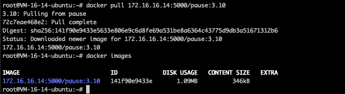

# 离线部署

### 下载离线包 (以 ubuntu24.04 系统 v1.31.6 版本为例)，并传到离线部署节点
- builder 获取（https://github.com/offline-hub/repo/releases/tag/download）
- pixiu镜像包（https://github.com/offline-hub/repo/releases/tag/download）
- k8s镜像包获取(https://github.com/offline-hub/repo/releases/tag/images)
- 安装包获取(https://github.com/offline-hub/repo/releases/tag/v1.31.6)


### 启动离线仓库
```
chmod +x builder
mkdir data
# 可使用 systemctl 管理
./builder serve  --dir data
```


### 将 3 个离线包移到 data目录里，进行自动加载


### 测试镜像仓库和源仓库可用性
```bash 
# ubuntu (ip根据实际情况调整)
echo 'deb [trusted=yes] http://172.16.16.14:8080/deb ./' > /etc/apt/sources.list.d/pixiu.list
apt update
```

#### 安装docker
```bash
apt-get install docker-ce

# 配置 insecure-registries
cat > /etc/docker/daemon.json <<'EOF'
{
  "insecure-registries": ["172.16.16.14:5000"]
}
EOF
systemctl start docker
systemctl enable docker
```


#### 安装 pixiu

#### 安装 mysql
```bash
docker run -d --net host --restart=always --privileged=true --name mariadb -e MYSQL_ROOT_PASSWORD="Pixiu868686" -e MYSQL_DATABASE="pixiu" 172.16.16.14:5000/mysql:5.7
```

#### 配置 pixiu
# 创建配置文件夹
mkdir -p /etc/pixiu/

# 后端配置(host 根据实际情况调整)
```bash
default:
  auto_migrate: true

  admin_user: admin
  admin_password: Pixiu123456!

# 数据库地址信息, 根据实际情况配置
mysql:
  host: 172.16.16.14
  user: root
  password: Pixiu868686
  port: 3306
  name: pixiu
```

### 安装 pixiu-server
```bash
docker run -d --net host --restart=always --privileged=true -v /etc/pixiu:/etc/pixiu -v /var/run/docker.sock:/var/run/docker.sock --name pixiu 172.16.16.14:5000/pixiu:v2.0.1-beta.5
```


### 页面验证
