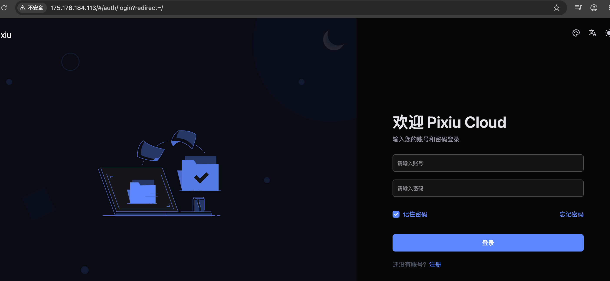
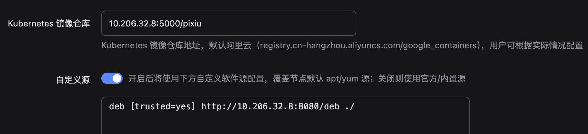
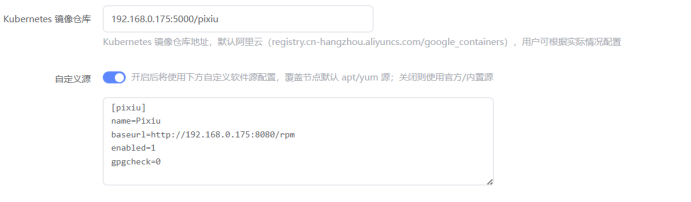

# 离线部署

### 下载离线包，并传到离线部署节点
- builder 二进制和 pixiu 镜像包 获取 [Pixiu基础包](https://github.com/offline-hub/repo/releases/tag/download)
- k8s 镜像包获取 [镜像包](https://github.com/offline-hub/repo/releases/tag/images)
- 安装包获取 [v1.31.6](https://github.com/offline-hub/repo/releases/tag/v1.31.6)

### 离线包部署
以系统 v1.31.6为例，将下载的镜像上传到服务器目录
#### 启动离线仓库
```
# 本例中 builder 是在 /home 目录下
chmod +x builder
# 使用 systemctl 管理
sudo vi /etc/systemd/system/pixiu-builder.service

# 配置如下
[Unit]
Description=Pixiu builder
After=network.target

[Service]
Type=simple
WorkingDirectory=/home # builder所在目录
ExecStart=/home/builder serve --dir data
Restart=always
RestartSec=5
Environment="PATH=/usr/local/sbin:/usr/local/bin:/usr/sbin:/usr/bin:/sbin:/bin"

[Install]
WantedBy=multi-user.target

# 配置完加载，并设置开机启动
sudo systemctl daemon-reload
sudo systemctl enable pixiu-builder
sudo systemctl start pixiu-builder
```

### 查看日志
```bash
root@localhost:~# journalctl -u pixiu-builder -f
加载离线产物到 ./serve-data ...
  已加载 0 个 bundle（跳过 0 个）
  未发现 .rpm/.deb，跳过软件源
软件源已启动: http://10.206.32.17:8080 （rpm=0 deb=0）
导入镜像到 registry 10.206.32.17:5000 ...
  已导入 0 个镜像

========== builder serve 就绪 ==========
Registry:  10.206.32.17:5000
  示例:
    docker pull 10.206.32.17:5000/<name>:<tag>
  Docker insecure-registries 需包含: "10.206.32.17:5000"
```

### 加载镜像，安装运行环境
- [Ubuntu24.04](Ubuntu.md)
- [KylinV10](KylinV10.md)

### 安装 pixiu

#### 安装 mysql
```bash
docker run -d --net host --restart=always --privileged=true --name mariadb -e MYSQL_ROOT_PASSWORD="Pixiu868686" -e MYSQL_DATABASE="pixiu" 10.206.32.8:5000/pixiu/mysql:5.7
```

#### 配置 pixiu
##### 创建配置文件夹 （文件夹路径不可修改）
mkdir -p /etc/pixiu/
vim /etc/pixiu/config.yaml 写入后端如下配置

##### 后端配置(host 根据实际情况调整)
```bash
default:
  auto_migrate: true

  admin_user: admin
  admin_password: Pixiu123456!

# 数据库地址信息, 根据实际情况配置
mysql:
  host: 10.206.32.8
  user: root
  password: Pixiu868686
  port: 3306
  name: pixiu
```

#### 安装 pixiu-server
```bash
docker run -d --net host --restart=always --privileged=true -v /etc/pixiu:/etc/pixiu -v /var/run/docker.sock:/var/run/docker.sock --name pixiu 10.206.32.8:5000/pixiu/pixiu:v2.0.1-beta.6
```


#### 页面验证


### 集群部署

#### 创建部署
指定 **Kubernetes 镜像仓库** 与 **自定义安装包源** 为私有地址。自定义源填写示例见 [自定义安装包仓库配置](../../docs/deploy/custom-repo.md)。

#### ubuntu配置参考如下：



#### 麒麟V10配置参考如下：

#### 调整 runner 为私有镜像


#### 完成部署
2分钟完成部署
```bash
root@VM-32-8-ubuntu:~# kubectl  get pod -A -o wide
NAMESPACE      NAME                                        READY   STATUS              RESTARTS   AGE     IP               NODE        NOMINATED NODE   READINESS GATES
kube-system    calico-kube-controllers-5d6c89b768-wkhxs    1/1     Running             0          2m53s   172.30.222.194   test-node   <none>           <none>
kube-system    calico-node-zc59j                           1/1     Running             0          2m53s   10.206.32.8      test-node   <none>           <none>
kube-system    calico-typha-c879574bd-4crm6                1/1     Running             0          2m53s   10.206.32.8      test-node   <none>           <none>
kube-system    coredns-798dfbc648-2smkr                    1/1     Running             0          3m14s   172.30.222.198   test-node   <none>           <none>
kube-system    coredns-798dfbc648-9fsp6                    1/1     Running             0          3m14s   172.30.222.196   test-node   <none>           <none>
kube-system    etcd-test-node                              1/1     Running             0          3m21s   10.206.32.8      test-node   <none>           <none>
kube-system    ingress-nginx-admission-create-krmzv        0/1     ImagePullBackOff    0          2m49s   172.30.222.199   test-node   <none>           <none>
kube-system    ingress-nginx-admission-patch-pq6pz         0/1     ImagePullBackOff    0          2m49s   172.30.222.197   test-node   <none>           <none>
kube-system    ingress-nginx-controller-857d64b88c-9njsc   0/1     ContainerCreating   0          2m49s   <none>           test-node   <none>           <none>
kube-system    kube-apiserver-test-node                    1/1     Running             0          3m21s   10.206.32.8      test-node   <none>           <none>
kube-system    kube-controller-manager-test-node           1/1     Running             0          3m21s   10.206.32.8      test-node   <none>           <none>
kube-system    kube-proxy-krv7d                            1/1     Running             0          3m14s   10.206.32.8      test-node   <none>           <none>
kube-system    kube-scheduler-test-node                    1/1     Running             0          3m21s   10.206.32.8      test-node   <none>           <none>
kube-system    metrics-server-5667f666f7-w2dl8             1/1     Running             0          2m52s   172.30.222.193   test-node   <none>           <none>```
```