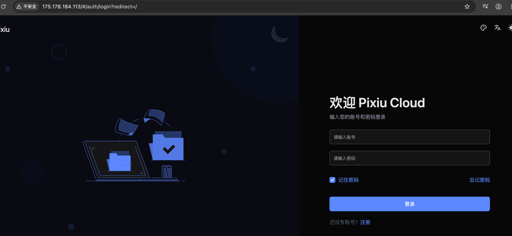
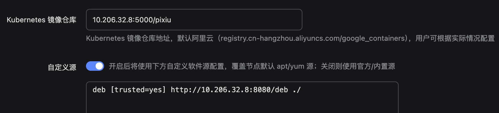
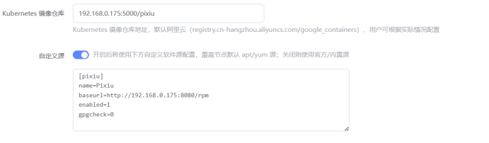

# 离线部署

### 下载离线包，并传到离线部署节点
- builder 二进制和 pixiu 镜像包 获取 [Pixiu基础包](https://github.com/offline-hub/repo/releases/tag/download)
- k8s 镜像包获取 [镜像包](https://github.com/offline-hub/repo/releases/tag/images)
- 安装包获取 [v1.31.6](https://github.com/offline-hub/repo/releases/tag/v1.31.6)

### 离线包部署
以系统 v1.31.6为例，将下载的镜像上传到服务器目录
#### 启动离线仓库
```
# 本例中 builder 是在 /home 目录下
chmod +x builder
# 使用 systemctl 管理
sudo vi /etc/systemd/system/pixiu-builder.service

# 配置如下
[Unit]
Description=Pixiu builder
After=network.target

[Service]
Type=simple
WorkingDirectory=/home
ExecStart=/home/builder serve --dir /home/data
Restart=always
RestartSec=5
Environment="PATH=/usr/local/sbin:/usr/local/bin:/usr/sbin:/usr/bin:/sbin:/bin"

[Install]
WantedBy=multi-user.target

# 配置完加载，并设置开机启动
sudo systemctl daemon-reload
sudo systemctl enable pixiu-builder
sudo systemctl start pixiu-builder
```

### 查看日志
```bash
root@localhost:~# journalctl -u pixiu_builder -f
加载离线产物到 ./serve-data ...
  已加载 0 个 bundle（跳过 0 个）
  未发现 .rpm/.deb，跳过软件源
软件源已启动: http://10.206.32.17:8080 （rpm=0 deb=0）
导入镜像到 registry 10.206.32.17:5000 ...
  已导入 0 个镜像

========== builder serve 就绪 ==========
Registry:  10.206.32.17:5000
  示例:
    docker pull 10.206.32.17:5000/<name>:<tag>
  Docker insecure-registries 需包含: "10.206.32.17:5000"
```

### 加载镜像，安装运行环境
- [Ubuntu24.04](Ubuntu.md)
- [KylinV10](KylinV10.md)

### 安装 pixiu

#### 安装 mysql
```bash
docker run -d --net host --restart=always --privileged=true --name mariadb -e MYSQL_ROOT_PASSWORD="Pixiu868686" -e MYSQL_DATABASE="pixiu" 10.206.32.8:5000/pixiu/mysql:5.7
```

#### 配置 pixiu
##### 创建配置文件夹 （文件夹路径不可修改）
mkdir -p /etc/pixiu/
vim /etc/pixiu/config.yaml 写入后端如下配置

##### 后端配置(host 根据实际情况调整)
```bash
default:
  auto_migrate: true

  admin_user: admin
  admin_password: Pixiu123456!

runtime:
  # 宿主容器运行时类型：docker / containerd，默认 containerd；docker 部署须显式写 docker
  cri: docker
  # 宿主运行时 socket 路径，只支持裸路径（如 /run/containerd/containerd.sock），不要写 unix:// 前缀
  #socket: /run/containerd/containerd.sock

# 数据库地址信息, 根据实际情况配置
mysql:
  host: 10.206.32.8
  user: root
  password: Pixiu868686
  port: 3306
  name: pixiu
```

#### 安装 pixiu-server
```bash
docker run -d --net host --restart=always --privileged=true -v /etc/pixiu:/etc/pixiu -v /var/run/docker.sock:/var/run/docker.sock --name pixiu 10.206.32.8:5000/pixiu/pixiu:v2.0.2-beta.1
```


#### containerd 环境差异（宿主使用 containerd 而非 docker 时）

前置：宿主需已安装并运行 `containerd`，容器操作统一使用 containerd 自带的 `ctr`，需要 root 权限。命令与 docker 版逐条对应，差异集中在**镜像导入的命名空间**、**containerd 状态路径的整目录挂载**与**配置中的 `runtime.cri`** 三点（见下文第 3 步）。

1）导出/导入镜像：containerd 的镜像存储按命名空间隔离，导出与导入都要指定同一命名空间。

在**联网机器**导出归档（镜像 tag 换成实际版本；示例与本文命令中的镜像引用一致）：

```bash
sudo ctr -n default images export pixiu-image.tar \
  10.206.32.8:5000/pixiu/pixiu:v2.0.2-beta.1
# 部署 runner 镜像同理（如 kubez-ansible），按需导出
sudo ctr -n default images export kubez-ansible.tar ccr.ccs.tencentyun.com/pixiucloud/kubez-ansible:v3.0.4
```

在**离线宿主**导入归档（必须导入到 pixiu 使用的命名空间，默认 `default`；`k8s.io` 里的镜像不会被 pixiu 直接复用）：

```bash
sudo ctr -n default images import pixiu-image.tar
sudo ctr -n default images import kubez-ansible.tar
sudo ctr -n default images ls                         # 确认已导入
```

- 给 kubelet 用的 k8s 集群运行时镜像走另一条路：`sudo ctr -n k8s.io images import`（如 `zcat images-export/images/*.tar.gz | sudo ctr -n k8s.io images import -`）。它与 pixiu 容器所用的 `default` 命名空间不是一回事，不要混用，也不要指望 pixiu 复用 k8s.io 里的镜像。
- 私有仓库为 HTTP/自签证书时，`ctr -n default images pull` 需加对应标志（HTTP 仓库用 `--plain-http`，自签 HTTPS 用 `-k`/`--skip-verify`；如 `sudo ctr -n default images pull --plain-http 10.206.32.8:5000/pixiu/pixiu:v2.0.2-beta.1`）。

2）启动：用 `ctr` 命令式拉起容器（容器名放在镜像之后），docker 版的 socket 挂载相应换成 containerd 状态路径。命令中 `/run/containerd` 与 `/var/lib/containerd` 为宿主 containerd 状态路径，必须整目录挂载——pixiu 会在容器内创建 fifo、执行镜像解包挂载，请勿精简该挂载；runner 容器日志固定写到 `/etc/pixiu/runner-logs`（随 `/etc/pixiu` 卷持久化，无需额外挂载）。

```bash
# 数据库
sudo ctr -n default run -d \
  --privileged \
  --net-host \
  --env MYSQL_ROOT_PASSWORD=Pixiu868686 \
  --env MYSQL_DATABASE=pixiu \
  10.206.32.8:5000/pixiu/mysql:5.7 \
  mariadb

# pixiu
sudo ctr -n default run -d \
  --privileged \
  --net-host \
  --mount type=bind,src=/etc/pixiu,dst=/etc/pixiu,options=rbind:rw \
  --mount type=bind,src=/run/containerd,dst=/run/containerd,options=rbind:rw \
  --mount type=bind,src=/var/lib/containerd,dst=/var/lib/containerd,options=rbind:rw \
  10.206.32.8:5000/pixiu/pixiu:v2.0.2-beta.1 \
  pixiu
```

3）配置：`/etc/pixiu/config.yaml` 中把运行时指向 containerd，pixiu 才会用 containerd 拉起部署 runner 容器（默认 containerd，不配置即使用 containerd）。

```yaml
runtime:
  cri: containerd
  #socket: /run/containerd/containerd.sock   # 与上方 run 命令中挂载的 socket 路径一致；留空即默认此路径
```

4）验证与卸载：

```bash
sudo ctr -n default containers ls          # 验证：应能看到 pixiu 与 mariadb
sudo ctr -n default tasks ls               # 两者应为 RUNNING
# 卸载（按需）：先停任务，再清理容器
sudo ctr -n default task kill -s SIGKILL pixiu mariadb
sudo ctr -n default task delete -f pixiu mariadb
sudo ctr -n default containers rm pixiu mariadb
```

#### 页面验证


### 集群部署

#### 创建部署
指定 Kubernetes 镜像仓库 和 自定义源为私有地址

#### ubuntu配置参考如下：



#### 麒麟V10配置参考如下：

#### 调整 runner 为私有镜像


#### 完成部署
2分钟完成部署
```bash
root@VM-32-8-ubuntu:~# kubectl  get pod -A -o wide
NAMESPACE      NAME                                        READY   STATUS              RESTARTS   AGE     IP               NODE        NOMINATED NODE   READINESS GATES
kube-system    calico-kube-controllers-5d6c89b768-wkhxs    1/1     Running             0          2m53s   172.30.222.194   test-node   <none>           <none>
kube-system    calico-node-zc59j                           1/1     Running             0          2m53s   10.206.32.8      test-node   <none>           <none>
kube-system    calico-typha-c879574bd-4crm6                1/1     Running             0          2m53s   10.206.32.8      test-node   <none>           <none>
kube-system    coredns-798dfbc648-2smkr                    1/1     Running             0          3m14s   172.30.222.198   test-node   <none>           <none>
kube-system    coredns-798dfbc648-9fsp6                    1/1     Running             0          3m14s   172.30.222.196   test-node   <none>           <none>
kube-system    etcd-test-node                              1/1     Running             0          3m21s   10.206.32.8      test-node   <none>           <none>
kube-system    ingress-nginx-admission-create-krmzv        0/1     ImagePullBackOff    0          2m49s   172.30.222.199   test-node   <none>           <none>
kube-system    ingress-nginx-admission-patch-pq6pz         0/1     ImagePullBackOff    0          2m49s   172.30.222.197   test-node   <none>           <none>
kube-system    ingress-nginx-controller-857d64b88c-9njsc   0/1     ContainerCreating   0          2m49s   <none>           test-node   <none>           <none>
kube-system    kube-apiserver-test-node                    1/1     Running             0          3m21s   10.206.32.8      test-node   <none>           <none>
kube-system    kube-controller-manager-test-node           1/1     Running             0          3m21s   10.206.32.8      test-node   <none>           <none>
kube-system    kube-proxy-krv7d                            1/1     Running             0          3m14s   10.206.32.8      test-node   <none>           <none>
kube-system    kube-scheduler-test-node                    1/1     Running             0          3m21s   10.206.32.8      test-node   <none>           <none>
kube-system    metrics-server-5667f666f7-w2dl8             1/1     Running             0          2m52s   172.30.222.193   test-node   <none>           <none>```
```
