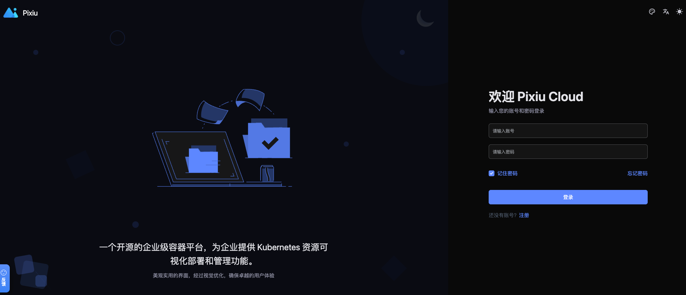

# 前置准备
```bash
准备部署虚拟机节点
```

# 安装 Pixiu
[基于 containerd 安装](containerd-install.md)

[基于 docker 安装](docker-install.md)

## 登陆 pixiu
```
# 根据配置文件中指定的账密输入；如果未指定默认用户名密码是 admin/Pixiu123456!
浏览器登陆: http://<ip>:<port>
```

## 页面效果


### 访问 APIs doc
```shell
curl http://127.0.0.1:8090/api-ref/index.html
```

### 第三方登录
- [飞书扫码登录与第三方登录配置](oauth-login.md)
